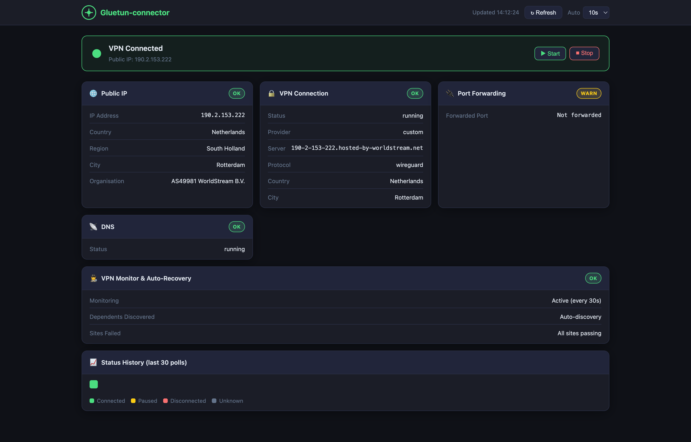

# Gluetun Connector

A lightweight web UI and Monitor wrapper for controlling [Gluetun](https://github.com/qdm12/gluetun) — the VPN client container for Docker.


---

## Features

- **Unified Solution**: Combines VPN Health Web UI and Automated Polling Recovery into a single container.
- **Web UI Dashboard**:
  - Live VPN status banner (connected / paused / disconnected)
  - Public exit IP, country, region, city, and organisation
  - Port forwarding and DNS status
  - Start / Stop VPN controls
  - Monitor status overview (failing sites, active polling)
- **Automatic Recovery**:
  - Tests sites through Gluetun's network in the background.
  - Automatically discovers dependent containers using `network_mode: container:gluetun`.
  - Restarts Gluetun and its dependents on connectivity loss.

---

## Screenshots



---

## Requirements

- Docker + Docker Compose
- Gluetun running with its HTTP control server enabled (default port `8000`)
- Gluetun and gluetun-connector on the same Docker network

> Supports `linux/amd64` and `linux/arm64` (works on Mac Intel/Apple Silicon, Linux, and Windows).

---

### Option A: Docker Compose (Recommended)

Add `gluetun-connector` to your existing compose file alongside Gluetun:

```yaml
gluetun-connector:
  build: .
  # Or image: yourname/gluetun-connector:latest
  container_name: gluetun-connector
  ports:
    - "127.0.0.1:3000:3000"
  environment:
    # --- Web UI Options ---
    - GLUETUN_CONTROL_URL=http://gluetun:8000

    # --- Monitor Options ---
    - GLUETUN_CONTAINER=gluetun
    - CHECK_INTERVAL=30
    - TIMEOUT=10
    - FAIL_THRESHOLD=2
    - DEPENDENT_CONTAINERS=auto # auto-discovers containers network_mode'd passing through gluetun
  volumes:
    - /var/run/docker.sock:/var/run/docker.sock:ro # Required for monitor auto-recovery
    - ./sites.conf:/config/sites.conf:ro # Sites to healthcheck (one per line)
  networks:
    - your_network_name
  restart: unless-stopped
  healthcheck:
    test: ["CMD", "/usr/local/bin/gluetun-connector", "--health-check"]
    interval: 30s
    timeout: 5s
    start_period: 10s
    retries: 3
```

Then run:

```bash
docker compose up -d
```

The UI is available at **http://localhost:3000**

### Option B: Build Locally

```bash
cd gluetun-connector
docker compose up -d --build
```

---

## Gluetun Authentication (Required)

Recent versions of Gluetun (v3.39.1+) require authentication for the control server by default.
To use this connector, you must configure an API key on your **Gluetun** container by adding this environment variable:

```yaml
gluetun:
  environment:
    - 'HTTP_CONTROL_SERVER_AUTH_DEFAULT_ROLE={"auth":"apikey","apikey":"your_secret_key"}'
```

Then pass that same key to the connector using `GLUETUN_API_KEY=your_secret_key`.

---

## Network Setup

Both Gluetun and gluetun-connector must be on the same Docker network so `http://gluetun:8000` resolves correctly.

**Same compose file** — just add both services to the same network (most common):

```yaml
services:
  gluetun:
    networks:
      - arr-stack
  gluetun-connector:
    networks:
      - arr-stack

networks:
  arr-stack:
    driver: bridge
```

**Separate compose files** — reference Gluetun's existing network as external. Find your network name with `docker network ls`:

```yaml
networks:
  ext-network:
    external: true
    name: your_gluetun_network_name
```

---

## Configuration

| Variable               | Default               | Description                                                    |
| ---------------------- | --------------------- | -------------------------------------------------------------- |
| `GLUETUN_CONTROL_URL`  | `http://gluetun:8000` | Gluetun HTTP control server URL                                |
| `GLUETUN_CONTAINER`    | `gluetun`             | Docker container name for Gluetun itself (used by Monitor)     |
| `DEPENDENT_CONTAINERS` | `auto`                | comma separated list `app1,app2` to restart on fail, or `auto` |
| `CHECK_INTERVAL`       | `30`                  | Seconds between connection connectivity tests (`sites.conf`)   |
| `FAIL_THRESHOLD`       | `2`                   | Consecutive failures before forcing restart                    |
| `TIMEOUT`              | `10`                  | Seconds for connection tests to abort per tick                 |
| `PORT`                 | `3000`                | Port the web UI listens on                                     |

---

## Security

- Port is bound to `127.0.0.1` — not exposed to the network
- Runs in a `FROM scratch` image — no shell, no OS userland, minimal attack surface
- Rate limiting applied to all API and static file routes
- Upstream error details are logged server-side only — generic messages returned to the browser
- URL validation at startup — exits immediately on malformed `GLUETUN_CONTROL_URL`
- Graceful shutdown on `SIGTERM`/`SIGINT` — in-flight requests complete cleanly

### Reverse-proxy authentication

The VPN start/stop controls have no built-in authentication. If you expose the UI beyond localhost, place it behind a reverse proxy with HTTP Basic auth.

**Caddy** (`Caddyfile`):

```
your.domain.com {
  basicauth {
    user $2a$14$<bcrypt-hash>
  }
  reverse_proxy localhost:3000
}
```

Generate a hash with: `caddy hash-password`

**Nginx** (`nginx.conf`):

```nginx
location / {
  auth_basic "Restricted";
  auth_basic_user_file /etc/nginx/.htpasswd;
  proxy_pass http://localhost:3000;
}
```

Generate a password file with: `htpasswd -c /etc/nginx/.htpasswd user`

**Traefik** (Docker labels):

```yaml
labels:
  - "traefik.enable=true"
  - "traefik.http.routers.gluetun-connector.rule=Host(`your.domain.com`)"
  - "traefik.http.routers.gluetun-connector.middlewares=auth"
  - "traefik.http.middlewares.auth.basicauth.users=user:$$apr1$$<hash>"
```

Generate a hash with: `htpasswd -nb user password`

---

## Acknowledgments

- **[Gluetun](https://github.com/qdm12/gluetun)** — The VPN client container this webui was built for
- **[gluetun-monitor](https://github.com/csmarshall/gluetun-monitor)** — Great monitoring tool to pair with this webui
- **AI-Assisted Development** — This project was built with AI assistance

---

## License

MIT
